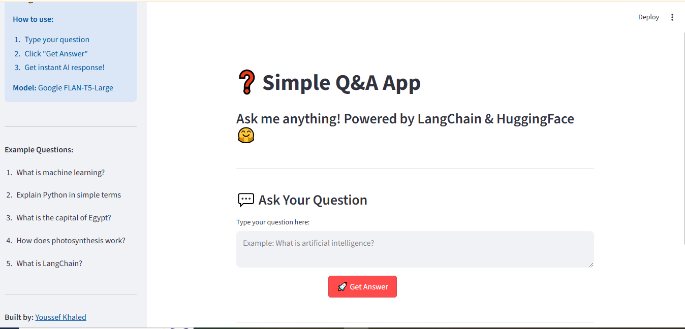
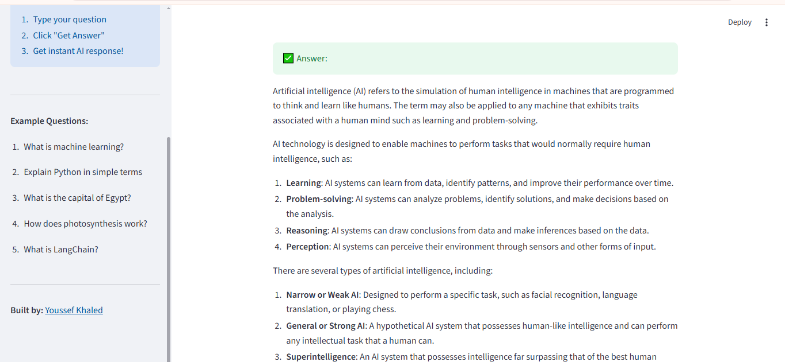

# ❓ Simple Q&A App

A simple Question & Answer application built with LangChain and Groq AI that provides instant AI-powered answers.


## 🚀 Live Demo

👉 [Try the App](https://youssef-qna-langchain.streamlit.app/)

## 🎯 About The Project

This app allows users to ask any question and get instant AI-powered answers
using LangChain framework and Groq's Llama3 model. It demonstrates the power
of Large Language Models (LLMs) in building simple yet powerful Q&A applications.

## ✨ Features

- 💬 Ask any question and get instant answers
- ⚡ Powered by Groq AI (Llama3 model) - extremely fast responses
- 🦜 Built with LangChain framework
- 🎨 Clean and simple Streamlit interface
- 📱 Responsive design works on all devices

## 🛠️ Technologies Used

- **LangChain** - Framework for LLM applications
- **Groq AI** - Llama3 model for fast inference
- **Streamlit** - Web interface
- **Python 3.10+**
- **python-dotenv** - Environment variables management

## 📸 Screenshots





## 🚀 Installation

1. Clone the repository:
```bash
git clone https://github.com/YoussefK-Ismail/Q-A-App-LangChain.git
cd Q-A-App-LangChain
```

2. Create virtual environment:
```bash
python -m venv venv
venv\Scripts\activate  # On Windows
```

3. Install dependencies:
```bash
pip install -r requirements.txt
```

4. Create `.env` file and add your Groq API key:
```
GROQ_API_KEY=your_groq_api_key_here
```

5. Run the app:
```bash
streamlit run app.py
```

## 💡 Usage

1. Open the app in your browser
2. Type your question in the text area
3. Click **"Get Answer"** button
4. Get instant AI-powered response!

## 💬 Example Questions

- What is artificial intelligence?
- Explain machine learning in simple terms
- What is LangChain?
- How does photosynthesis work?

## 🔮 Future Improvements

- [ ] Add conversation history
- [ ] Support Arabic language
- [ ] Add voice input option
- [ ] Implement different AI models
- [ ] Add chat export functionality

## 👤 Author

**Youssef Khaled**
- 🌐 Portfolio: [youssefkhaledportfolio.netlify.app](https://youssefkhaledportfolio.netlify.app)
- 💻 GitHub: [@YoussefK-Ismail](https://github.com/YoussefK-Ismail)

## 📄 License

MIT License

---
Made with ❤️ using LangChain & Streamlit
